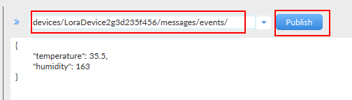

# Connecting to an Azure IoT Hub using MQTT FX 

## Objectives and Requirements

### Objectives 
1. Build and Run the Azure IoT Hub SAS Token Generator
1. Generate a SAS Token
1. Connect to an Azure IoT Hub using the generated SAS Token
1. Send an Device message using MQTT to the Azure IoT Hub

### Requirements
1. Microsoft Visual Studio Community, Professional or Enterprise 2017
1. Access to an Azure Subscription with an Azure IoT Hub resource and a registered Device
1. [MQTT FX](http://mqttfx.jensd.de/index.php/download)

## Instuctions

### Generator a SAS Token
1. Clone or download this Git repository
1. Open the solution "Azure.IoTHub.Tools.sln" in Visual Studio
1. Run the token generator from Visual Studio (Debug->Start without Debugging or Cntrl + F5 )
1. Follow the console app instructions to create a SAS Token
1. If you choose to sign the SAS Token with the a Shared Access Policy Key, ensure you type in the correct name for the Shared Access Policy. You won't be prompted for this value if you choose to sign the SAS Token with a Device Symmetric Key (and using this method you will notice that  a ```skn``` value is not present in the SAS Token string). 
1. You will find the Device Symetric Key or the Shared Acccess Policy Key in the Azure portal, in appropriate section in the IoT Hub Resource
1. When the SAS Token is generated make sure to copy the whole token to your clipboard, including the ```SharedAccessSignature``` part of the string, e.g. 

```SharedAccessSignature sr=asdfasdf%2Fdevices%2F123456789&sig=38hluU05yza1IZzDz66nOkAJExBXAIGSWUeh3W2a6T0%3D&se=1511398595&skn=ProtocolGateway```


### Connect to an Azure IoT Hub using a SAS Token and MQTT FX
1. Open the MQTT FX app
1. Click on the Cogs icon to create a new connection profile

    

1. In the "Edit Connection Profiles" modal click the Add icon at the bottom left of the modal

    

1. Give your new connection profile a name

1. In the General tab,  "Broker Address" should be set to the name of your IoT Hub, e.g. ```Dev-Test123.azure-devices.net```
1. "Broker Port" should be set to ```8883```
1. "Client Id" should be set the unique Device Identifier you want to connect to the IoT Hub, e.g. ```"LoraDevice2g3d235f456"```. This value should match a Device you currently have registered in your IoT Hub.

    

1. Click on the "User Credentials" tab
1. Set the "User Name" value to this format, ```[Name of your IoT Hub]/[Device Identifier]``` e.g

    ```Dev-Test123.azure-devices.net/LoraDevice2g3d235f456```

1. Set the "Password" value to the SAS Token string you created in the first part of this tutorial, e.g. 

    ```SharedAccessSignature sr=asdfasdf%2Fdevices%2F123456789&sig=38hluU05yza1IZzDz66nOkAJExBXAIGSWUeh3W2a6T0%3D&se=1511398595&skn=ProtocolGateway```

    
    
1. Click on the "SSL/TLS" tab and check the "Enable SSL / TLS" checkbox. Choose the CA signed server certificate and make sure the "Protocol" dropdown is set to "TLSv1.2"

    

1. Click "OK" to save the connection profile and return to the main app form. 
1. Make sure the correct profile is selected and click "Connect" to connect to the IoT Hub. 

    

1. The status circle on the right hand side of the form should go green to indicate a succesful connection. 

### Send a Device message to an Azure IoT Hub

1. Make sure the status icon on the right side of the form is green. 

1. In the main form, in the "Publish" section, set the topic path to:

    ```devices/[Device Identifier]/messages/events/```

    where  ```[Device Identifier]``` represents the unique identifier of the Device that you are sending the message. This might look something like 

    ```devices/LoraDevice2g3d235f456/messages/events/``` 
    
    **!  Make sure there is a trailing ```/``` at the end of the topic name, as shown in the above string values**
1. Add some content to the message body and click the Publish button



1. You should see a success message appear in the Log


[End of Tutorial]


